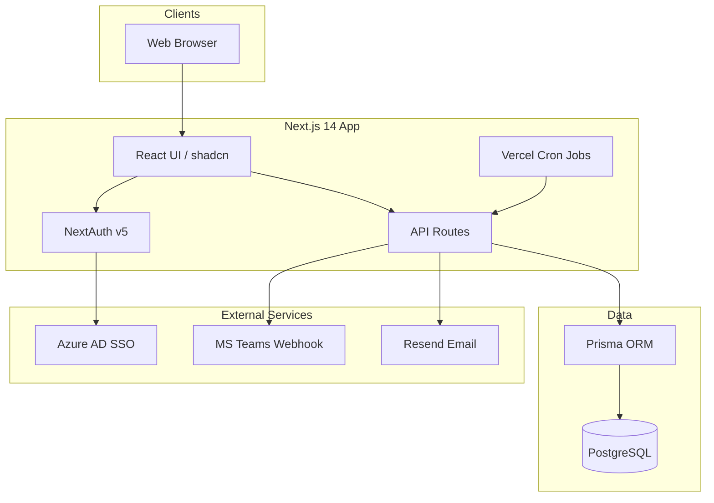

# AtomGoal — Architecture Overview

## System context

## Core domains

| Domain | Key routes | Notes |
|--------|------------|-------|
| Goals | `/employee/goals`, `/api/goals` | Weightage 100%, max 8 goals, min 10% each |
| Approvals | `/manager/approvals`, submit/approve/reject APIs | Locks sheet on approve |
| Check-ins | `/employee/goals/[id]/checkin`, `/api/achievements` | Quarter windows enforced |
| Admin | `/admin/*` | Users, cycles, reports, escalations |
| Notifications | Bell UI, `/api/notifications` | In-app + email + Teams |

## Role model

- **EMPLOYEE** — create/submit goals, log achievements
- **MANAGER** — approve team sheets, team check-ins, team analytics
- **ADMIN** — full org config, reports, unlock sheets, escalations

## Background jobs

| Cron | Schedule | Purpose |
|------|----------|---------|
| `check-reminders` | Daily 9:00 | Quarterly achievement reminders |
| `escalation-check` | Daily 10:00 | Escalation rule engine |
| `cycle-open` | Monthly 1st | Phase sync + cycle start alerts |

Protected by `CRON_SECRET` bearer token.
